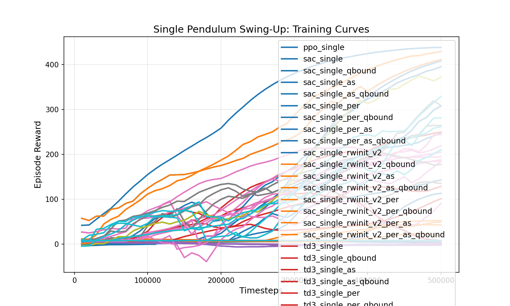
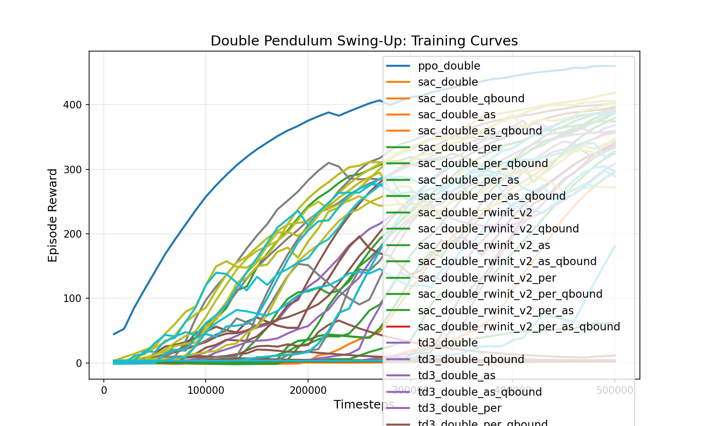
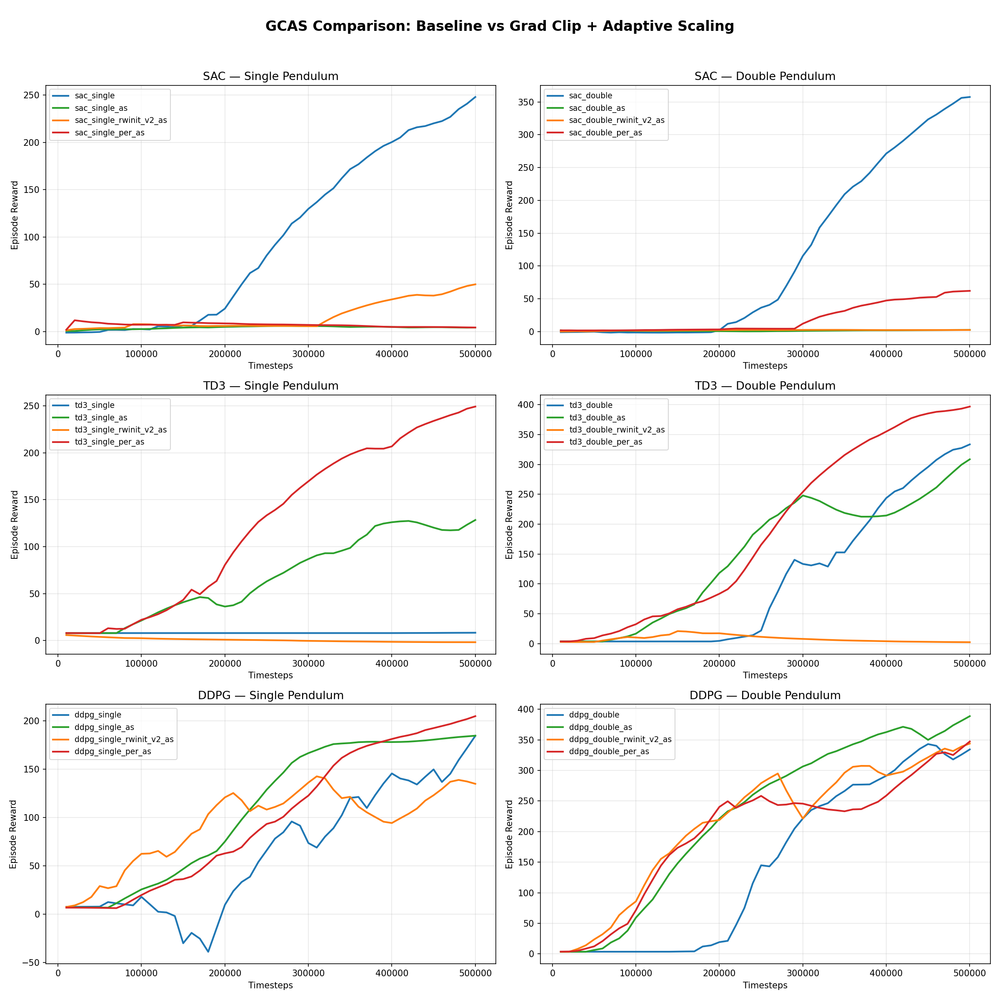
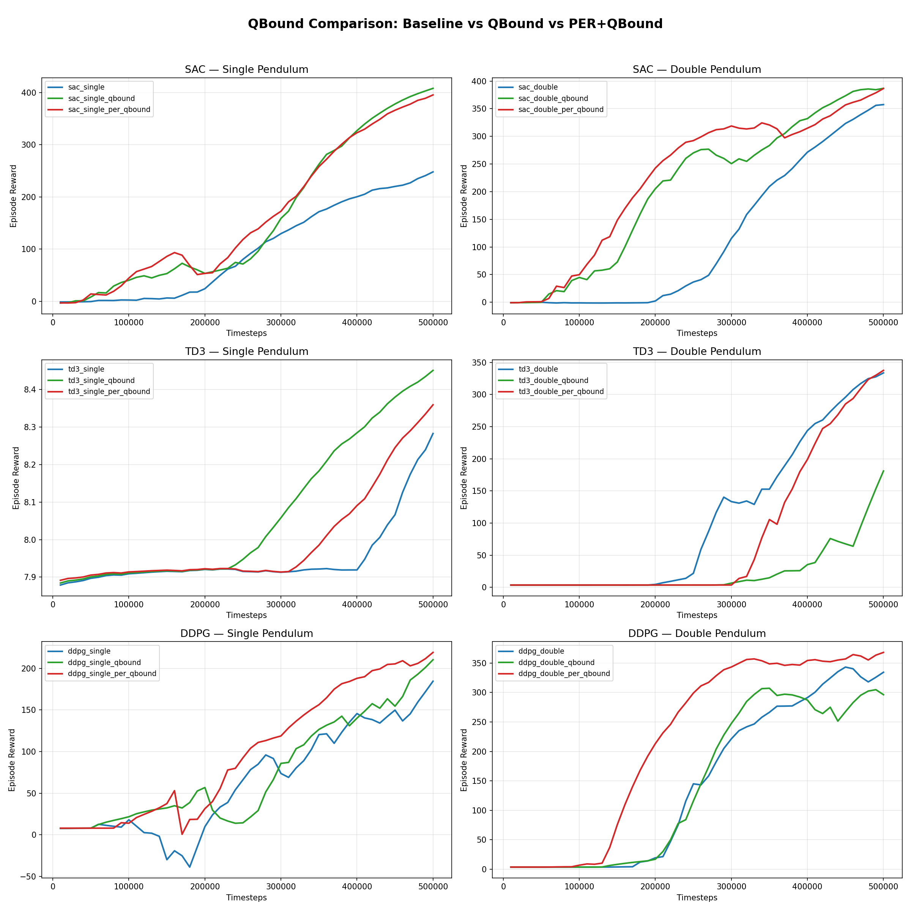
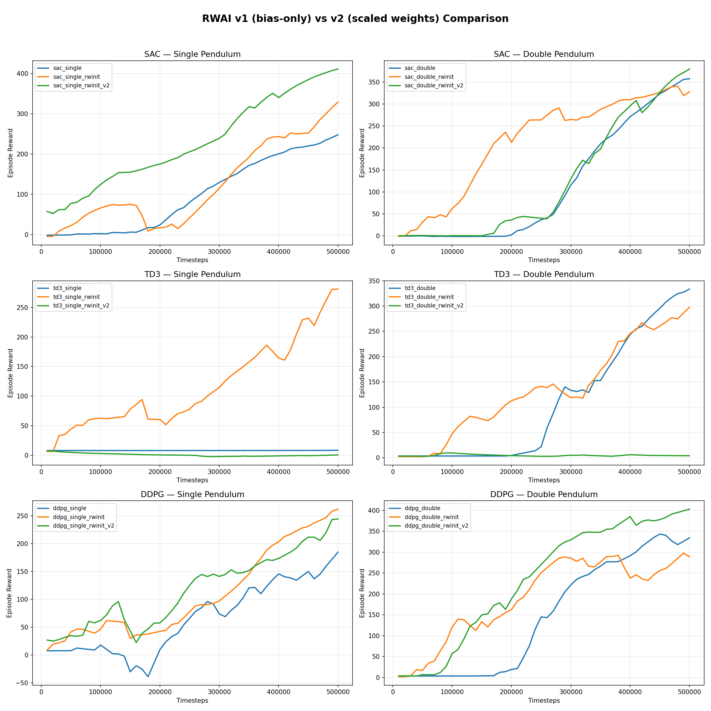
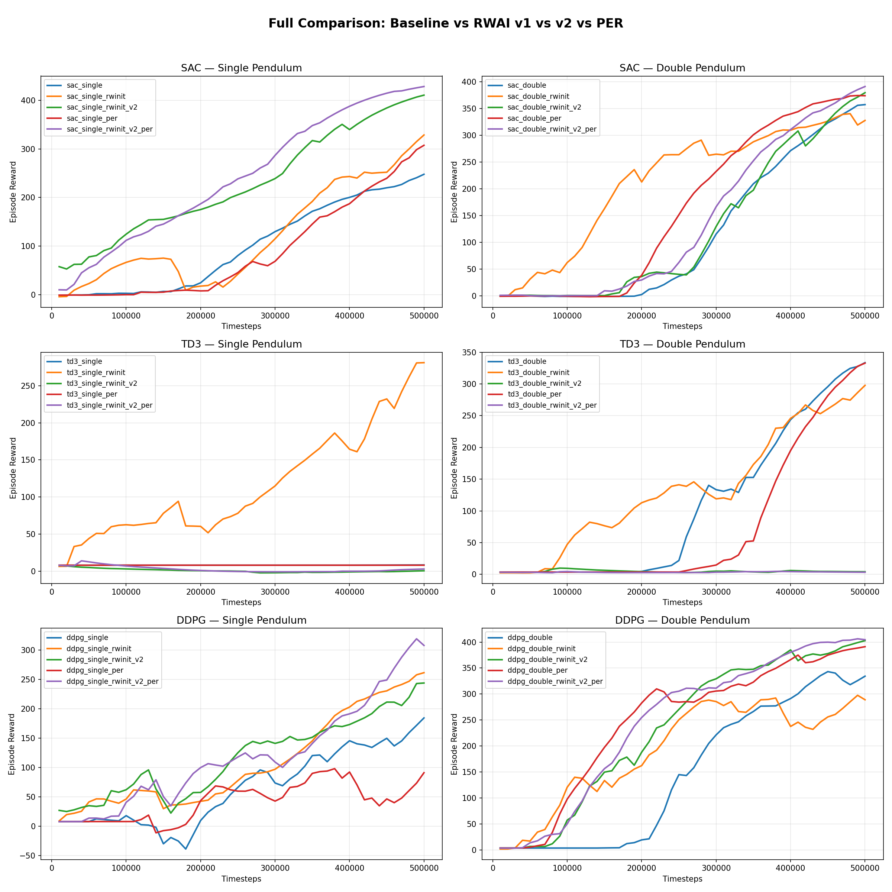

# Combinatorial Ablation of Training Stabilization Techniques for Off-Policy Deep RL

A comprehensive **110-experiment** study evaluating how five complementary techniques — critic initialization, gradient clipping, adaptive scaling, Q-value bounding, and prioritized experience replay — affect off-policy algorithm performance on hard-exploration continuous control tasks.

We train SAC, TD3, and DDPG agents (plus PPO baselines) to **swing up and balance** inverted pendulums, testing all **2^4 = 16 combinations** of four techniques per algorithm-environment pair. The full combinatorial ablation reveals that technique effectiveness is **strongly algorithm-dependent**: QBound improves SAC by +45% but has no effect on TD3; Adaptive Scaling rescues TD3 from exploration failure but destroys SAC.

## Techniques

All off-policy experiments include **Gradient Clipping** (`max_grad_norm=1.0`) as standard infrastructure. The four techniques ablated combinatorially are:

1. **RWAI v2 (Reward-Range-Aware Initialization)** — Sets critic last-layer bias to Q_midpoint and scales weights to match the expected Q-value standard deviation. Provides informed initial Q-estimates rather than near-zero defaults. Requires `norm_reward=False` so raw Q-values match the known bounds.

2. **PER (Prioritized Experience Replay)** — Proportional prioritization with sum-tree sampling, IS weight correction (beta annealed 0.4→1.0), and max-priority decay. Focuses updates on transitions with highest TD error.

3. **[AS (Adaptive Scaling)](https://github.com/TesfayZ/gradient_asymetry_AND_activation_saturation)** (Gebrekidan) — Tracks running mean/std of pre-tanh activations (EMA, decay=0.99) and rescales them to `[-target_range, +target_range]`, keeping them in the high-gradient region of tanh to prevent saturation. Uses `k_std=2.5` (captures ~99% of distribution).

4. **[QBound](https://github.com/TesfayZ/QBound)** (Gebrekidan) — Two-stage hard clipping on critic TD targets `[Q_min, Q_max]` and soft (softplus, beta=5.0) clipping on actor Q-values, constraining estimates within the theoretically achievable return range.

## Environments

| Task | Description | Obs | Act | Max Steps | Reward Range |
|------|-------------|-----|-----|-----------|:------------:|
| **Single Pendulum** (`CartPoleSwingUp-v0`) | Swing pole from DOWN to UP, balance | 5D: `[x, sin(θ), cos(θ), ẋ, θ̇]` | 1D force `[-1,1]` | 500 | `[-0.5, 1.0]` |
| **Double Pendulum** (`DoubleCartPoleSwingUp-v0`) | Swing two serial poles UP, balance | 8D: `[x, sin(θ₁), cos(θ₁), sin(θ₂), cos(θ₂), ẋ, θ̇₁, θ̇₂]` | 1D force `[-1,1]` | 1000 | `[-0.5, 1.0]` |

Both environments use custom **Lagrangian mechanics** (no external physics engine) with **RK4 integration** and sub-stepping (2 steps single, 4 steps double). Angles are represented as sin/cos pairs to avoid discontinuity at ±π. Cart terminates at `|x| > 2.4m`.

## Project Structure

```
├── envs/
│   ├── cartpole_swingup.py            # Single pendulum (Lagrangian dynamics + RK4)
│   └── double_cartpole_swingup.py     # Double pendulum (3x3 mass matrix + RK4)
├── custom_policies.py                 # RWAI + adaptive scaling policy classes
├── gc_algorithms.py                   # Gradient-clipped algorithm subclasses
├── qbound.py                          # QBound algorithm subclasses
├── per_algorithms.py                  # PER algorithm subclasses (legacy)
├── per_buffer.py                      # Prioritized Experience Replay buffer (sum-tree)
├── utils.py                           # Shared utilities (scaler buffer sync)
├── configs.py                         # All 110 experiment configurations
├── train.py                           # Training entry point
├── test.py                            # Evaluation + video recording
├── plot_results.py                    # Training curve visualization
├── run_all.py                         # Batch experiment runner with grouping
├── figures/                            # Training curve plots (committed)
├── results/                           # Trained models + logs (gitignored)
└── report/
    ├── report.md                      # Full paper (Markdown)
    └── paper.tex                      # Full paper (LaTeX)
```

## Getting Started

### 1. Install dependencies

```bash
pip install -r requirements.txt
```

Requires Python 3.10+. Key dependencies: `stable-baselines3==2.7.1`, `gymnasium==1.0.0`, `torch==2.5.0`, `numpy==1.26.4`, `matplotlib==3.9.0`, `pygame==2.6.0`.

### 2. Train experiments

```bash
# Train a single experiment (experiment names follow the pattern: {algo}_{env}_{variants})
python train.py -e sac_single              # SAC baseline on single pendulum (GC only)
python train.py -e sac_single_qbound       # SAC + QBound
python train.py -e td3_double_per_as       # TD3 + PER + AS on double pendulum
python train.py -e sac_single_rwinit_v2_per_as_qbound  # SAC with all 4 techniques

# Same patterns for td3_ and ddpg_ prefixes
# Same for double pendulum: replace _single with _double

# Train all 110 experiments (skips existing final_model.zip)
python train.py --all

# Or use the batch runner with grouping and progress tracking
python run_all.py                        # Run all experiments
python run_all.py --group ppo            # Run only PPO baselines
python run_all.py --group baselines      # Run only off-policy baselines (GC only)
python run_all.py --group contributions  # Run only experiments with technique combinations
python run_all.py --dry-run              # Show what would run without executing
```

Each experiment saves to `results/{experiment_name}/`: trained model (`final_model.zip`), eval logs (`eval_logs/evaluations.npz`), training monitor (`monitor.csv`), and config (`experiment_config.json`).

### 3. Evaluate a trained model

```bash
python test.py --experiment sac_single --episodes 20        # Run 20 eval episodes
python test.py --experiment sac_single --record              # Save video to results/
python test.py --experiment sac_single --record --random-init  # Random start angles
```

### 4. Generate comparison plots

```bash
python plot_results.py                        # All training curves (single, double, combined)
python plot_results.py --v1-vs-v2             # RWAI v1 vs v2 comparison (3x2 grid)
python plot_results.py --full-comparison      # Baseline/v1/v2/PER comparison (3x2 grid)
python plot_results.py --gcas-comparison      # Baseline/AS/RWAI+AS/PER+AS (3x2 grid)
python plot_results.py --qbound-comparison    # Baseline/QBound/PER+QBound (3x2 grid)
```

Plots are saved as PNGs in `results/` (pre-generated plots are in `figures/`). Each comparison plot shows a 3x2 grid (SAC/TD3/DDPG × single/double) with smoothed training curves and prints a summary table to stdout.

## Experiment Matrix

### PPO (on-policy baseline, 2 experiments)

PPO is on-policy and re-estimates values each epoch, so RWAI/PER/AS/QBound contributions are not applicable.

| Env | Experiment |
|-----|-----------|
| Single | `ppo_single` |
| Double | `ppo_double` |

### Off-Policy Algorithms (SAC, TD3, DDPG)

Each off-policy algorithm runs with all 2^4 = 16 combinations of four contributions.
All variants include gradient clipping (`max_grad_norm=1.0`) as standard.

| Variant | RWAI v2 | PER | AS | QBound |
|---------|:-------:|:---:|:--:|:------:|
| baseline (GC only) | | | | |
| `_rwinit_v2` | ✓ | | | |
| `_per` | | ✓ | | |
| `_as` | | | ✓ | |
| `_qbound` | | | | ✓ |
| `_rwinit_v2_per` | ✓ | ✓ | | |
| `_rwinit_v2_as` | ✓ | | ✓ | |
| `_rwinit_v2_qbound` | ✓ | | | ✓ |
| `_per_as` | | ✓ | ✓ | |
| `_per_qbound` | | ✓ | | ✓ |
| `_as_qbound` | | | ✓ | ✓ |
| `_rwinit_v2_per_as` | ✓ | ✓ | ✓ | |
| `_rwinit_v2_per_qbound` | ✓ | ✓ | | ✓ |
| `_rwinit_v2_as_qbound` | ✓ | | ✓ | ✓ |
| `_per_as_qbound` | | ✓ | ✓ | ✓ |
| `_rwinit_v2_per_as_qbound` | ✓ | ✓ | ✓ | ✓ |

**Total**: 3 algos × 2 envs × 16 variants + 2 PPO + 6 legacy RWAI v1 + 6 `norm_reward=False` baselines = **110 experiments**

Experiments using RWAI v2 or QBound set `norm_reward=False` to align raw Q-values with known bounds. Dedicated `_no_norm_reward` baselines (6 experiments) enable fair comparison by isolating the effect of disabling reward normalization. Legacy RWAI v1 experiments (`_rwinit` suffix) are retained for diagnostic reference.

## How AS (Adaptive Scaling) Works

**[Adaptive Scaling](https://github.com/TesfayZ/gradient_asymetry_AND_activation_saturation)** (Gebrekidan) addresses tanh saturation in actor networks. When pre-activation values drift far from zero, tanh gradients vanish, stalling learning.

```python
# AdaptiveGradientScaler: tracks running mean/std, rescales to [-target_range, +target_range]
std = g_var.clamp(min=1e-6).sqrt()
half_range = k_std * std  # k_std=2.5 (captures 99% of distribution)
scaled = (x - g_mean) / half_range * target_range  # → tanh stays in high-gradient zone
```

All off-policy experiments also include **gradient clipping** (`max_grad_norm=1.0`) to prevent gradient explosions, especially with PER's non-uniform sampling.

## How QBound Works

**[QBound](https://github.com/TesfayZ/QBound)** (Gebrekidan) clips Q-values to environment-aware bounds during TD target computation:

```python
# Two-stage hard clipping on critic targets:
next_q = clamp(Q_target(s', a'), Q_min, Q_max)       # Stage 1
target = clamp(r + γ * next_q, Q_min, Q_max)          # Stage 2

# Soft (softplus, beta=5.0) clipping on actor Q-values to preserve gradients:
q_clipped = Q_max - softplus(Q_max - (Q_min + softplus(q - Q_min, beta=5)), beta=5)
```

Bounds derived from geometric series with `r_min=-0.5, r_max=1.0`:
- Single pendulum: `Q ∈ [-49.67, 99.34]`
- Double pendulum: `Q ∈ [-50.0, 100.0]`

Requires `norm_reward=False` so raw Q-values match the known bounds.

## How RWAI Works

```python
# v1 (bias-only): shift critic output bias to Q_midpoint
nn.init.constant_(layer.bias, (q_min + q_max) / 2)

# v2 (scaled): also scale weights to match expected Q-value std
scale = min(target_std / current_std, 100.0)  # capped to prevent extreme scaling
layer.weight.data *= scale
layer.bias.data = layer.bias.data * scale + q_mid * (1 - scale)
```

Q-range computed from geometric series: `Q_max = r_max · (1 - γ^H) / (1 - γ)`

## Environments

### Physics
- Custom **Lagrangian mechanics** (no external physics engine)
- **RK4 integration** with sub-stepping (2 steps single, 4 steps double)
- Angle representation: **sin/cos pairs** (avoids discontinuity at ±π)
- Cart termination at `|x| > x_threshold` (2.4m)

### Reward Design
```
reward = uprightness - cart_penalty - control_penalty - velocity_penalty
       = (cos(θ)+1)/2 - 0.01·x² - 0.001·a² - 0.002·upright⁴·θ̇²
```

Reward range: `[-0.5, 1.0]` per step. Velocity penalty uses smooth `upright⁴` activation to avoid reward discontinuity near the upright position.

## Key Results (110 Experiments Completed)

### Best Configurations per Algorithm

| Algorithm | Environment | Best Configuration | Best / Final Reward |
|-----------|-------------|-------------------|:-------------------:|
| **SAC** | Single | PER + QBound | 453.6 / 453.5 |
| **SAC** | Double | RWAI v2 | 482.9 / 453.7 |
| **TD3** | Single | PER + AS | 292.5 / 269.5 |
| **TD3** | Double | PER + QBound | 457.1 / 405.8 |
| **DDPG** | Single | RWAI v2 + PER | 455.4 / 206.2 |
| **DDPG** | Double | baseline | 478.6 / 411.2 |
| **PPO** | Single | baseline | 450.2 / 439.0 |
| **PPO** | Double | baseline | 488.0 / 458.7 |

### Technique Effectiveness Summary

| Technique | SAC | TD3 | DDPG |
|-----------|:---:|:---:|:----:|
| **RWAI v2** | Strong positive | Destructive | High peak, unstable |
| **PER** | Moderate alone, great with QBound | Neutral alone, great with AS | Mixed |
| **AS** | **Catastrophic** (destroys SAC) | **Rescues** exploration | Mixed |
| **QBound** | **Excellent** (+45% single) | Neutral | Neutral |

### Key Findings

1. **QBound is the most beneficial single technique for SAC** -- improves single pendulum from 312→453
2. **Adaptive Scaling destroys SAC but rescues TD3** -- incompatible with squashed Gaussian policy
3. **RWAI v2 helps SAC significantly** (482.9 peak on double) but destabilizes TD3
4. **PER amplifies other techniques** -- PER+QBound and PER+AS are the best combos
5. **No universal best technique** -- optimal configuration is algorithm-dependent

### Generated Plots








## Full Paper

See [report/report.md](report/report.md) for the complete analysis including related work, method details, and all 110-experiment results.
Also available as LaTeX: [report/paper.tex](report/paper.tex).

## Citation

If you use this work in your research, please cite:

```bibtex
@misc{gebrekidan2026combinatorial,
  author       = {Gebrekidan, Tesfay Zemuy},
  title        = {Critic Initialization, Gradient Stabilization, and Q-Value Regularization for Off-Policy Deep Reinforcement Learning},
  year         = {2026},
  url          = {https://github.com/TesfayZ/RL-Stabilization-Ablation}
}
```

## License

This project is released under the MIT License. See [LICENSE](LICENSE) for details.

## Author

Tesfay Zemuy Gebrekidan, PhD
- Email: tzemuy13@gmail.com
- GitHub: https://github.com/TesfayZ
